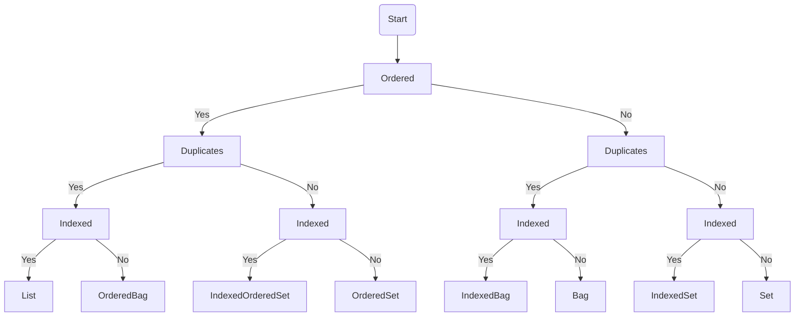

```mermaid
graph TD
A(Start) --> C[Ordered]
C -->|Yes| D[Duplicates]
C -->|No| E[Duplicates]
D -->|Yes| F[Indexed]
D -->|No| G[Indexed]
E -->|Yes| H[Indexed]
E -->|No| I[Indexed]
F -->|Yes| J[List]
F -->|No| K[OrderedBag]
G -->|Yes| L[IndexedOrderedSet]
G -->|No| M[OrderedSet]
H -->|Yes| N[IndexedBag]
H -->|No| O[Bag]
I -->|Yes| P[IndexedSet]
I -->|No| Q[Set]
```